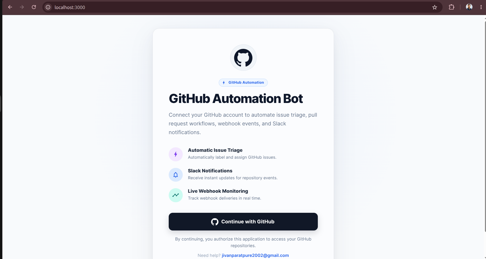
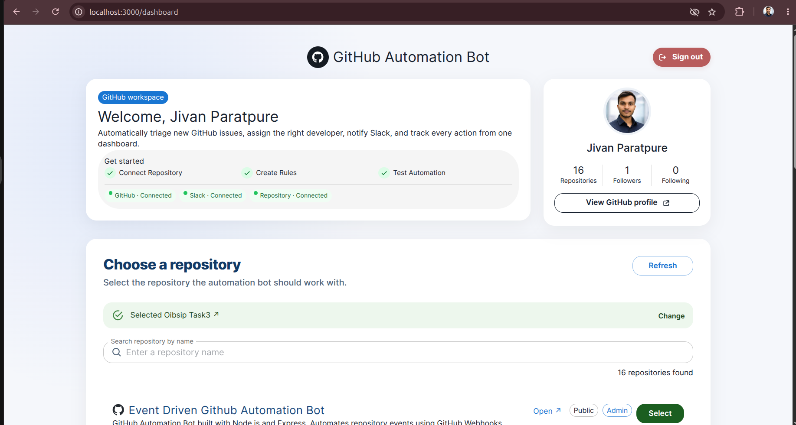
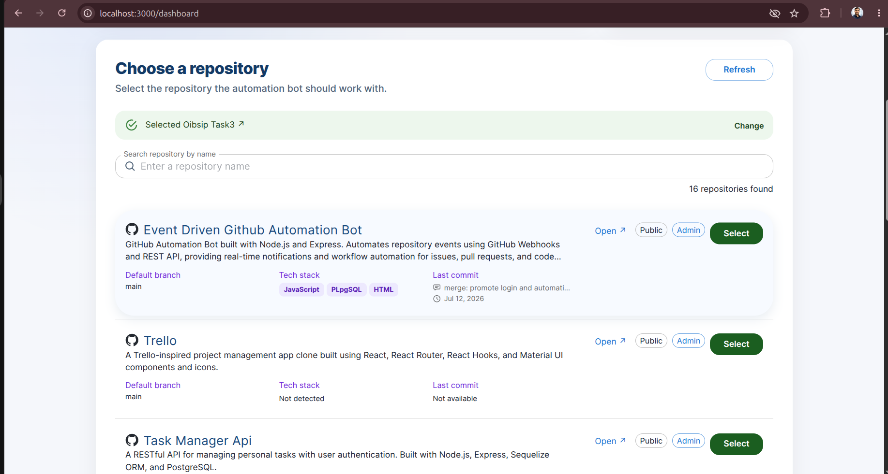
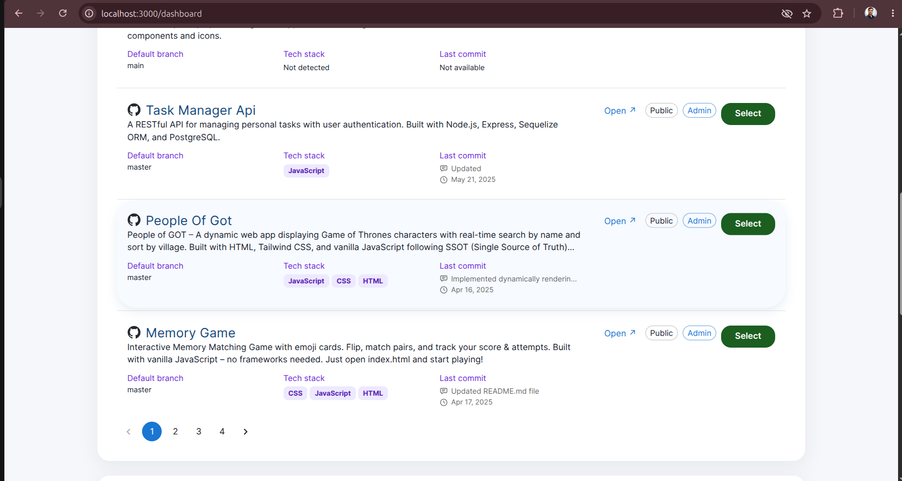
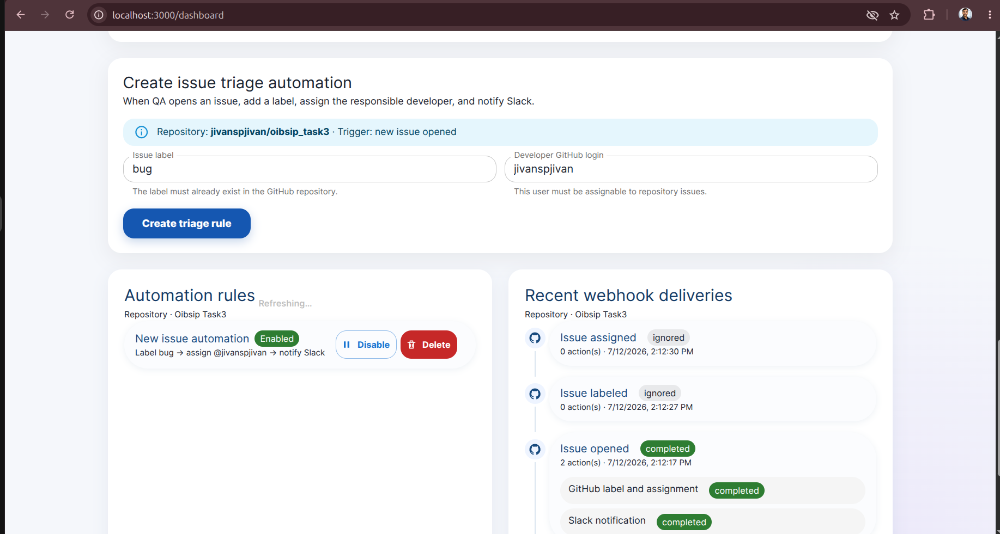
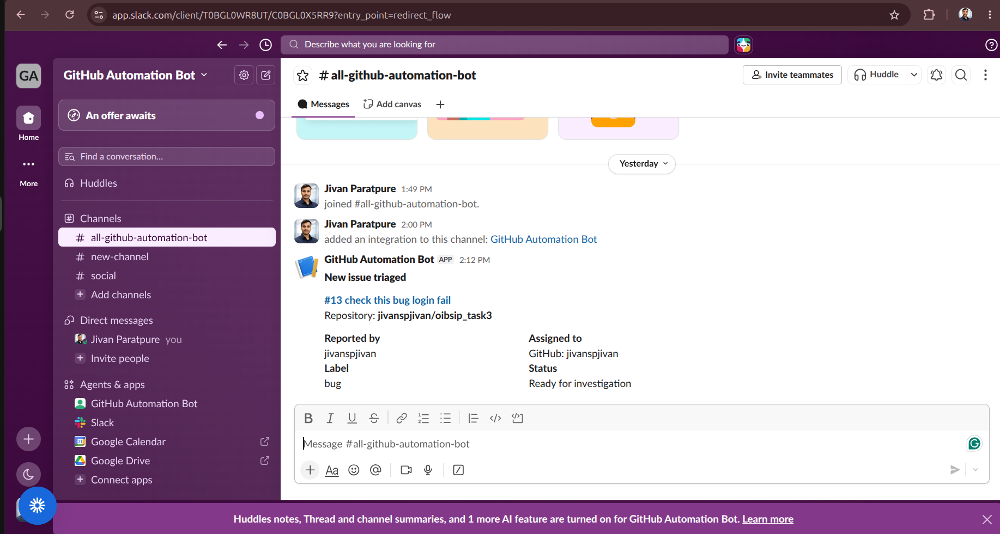
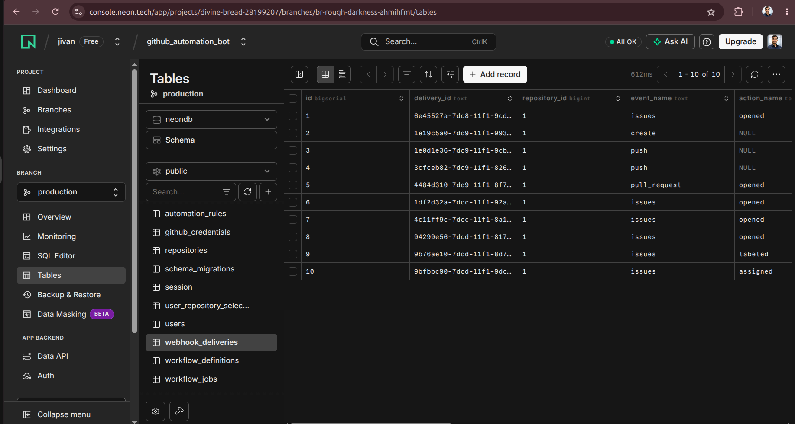
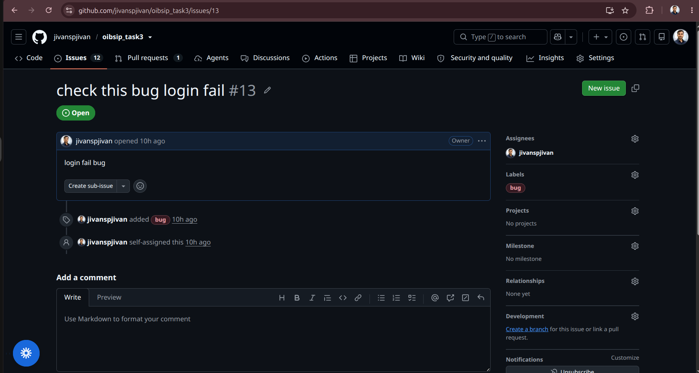
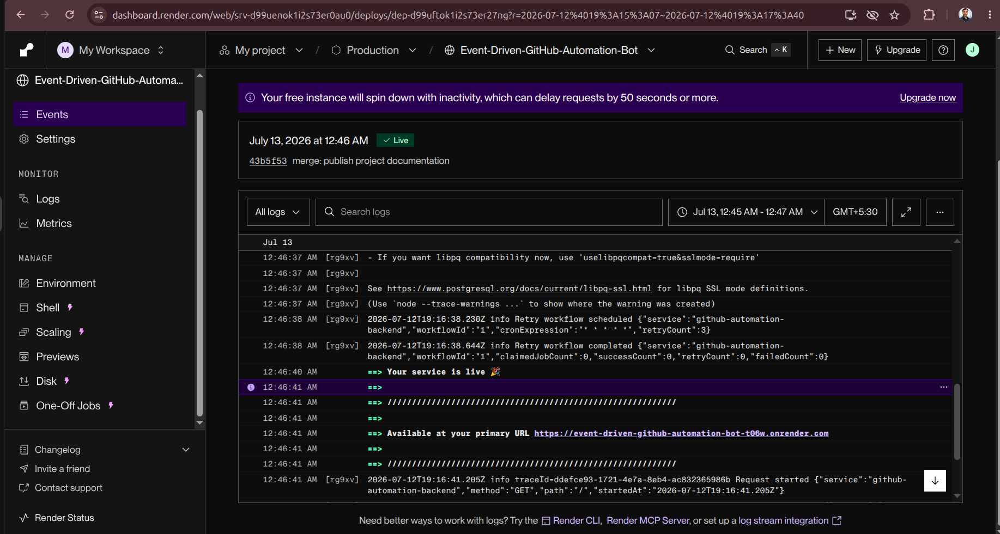
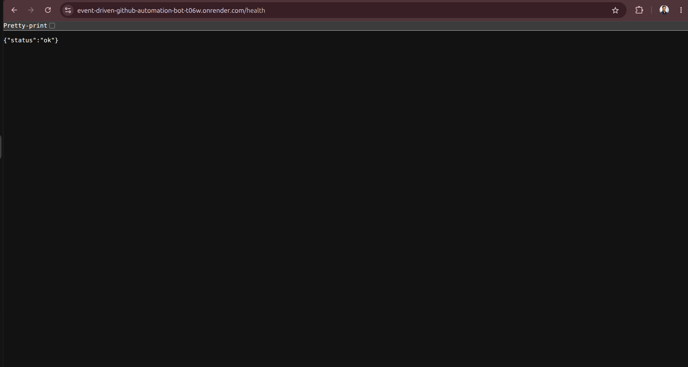

# Event-Driven GitHub Automation Bot

A full-stack SaaS-style automation dashboard that connects to GitHub, receives signed repository webhooks, runs configurable issue-triage workflows, writes results back to GitHub, sends Slack notifications, and records every delivery and retry in PostgreSQL.

> **Live frontend:** https://github-automation-bot-frontend-j9ft.onrender.com
>
> **Live backend:** https://event-driven-github-automation-bot-t06w.onrender.com
>
> Both services are publicly reachable on Render. Production OAuth environment variables still need to be updated from localhost before the deployed sign-in flow is ready.

## Features

- GitHub OAuth authentication with a PostgreSQL-backed session.
- Searchable and paginated GitHub repository selection.
- Signed GitHub webhook endpoint for `issues`, `pull_request`, and `push` events.
- Issue triage that adds a GitHub label and assigns a developer.
- Slack notifications for matched issue-triage rules.
- Authenticated dashboard with automation rules and webhook history.
- Duplicate-delivery protection using the GitHub delivery ID.
- Durable PostgreSQL workflow jobs with retries and stale-job recovery.
- Structured Winston logs with request trace IDs.
- Encrypted GitHub automation credentials using AES-256-GCM.

## Application workflow

```text
User signs in with GitHub
        ↓
Selects a repository
        ↓
Creates an issue-triage rule
        ↓
GitHub sends a signed webhook
        ↓
Backend verifies and stores the delivery
        ↓
Durable workflow worker processes the event
        ↓
GitHub label + assignee ── Slack notification
        ↓
Dashboard displays delivery, actions, failures, and retries
```

## Technology stack

| Area | Technology |
| --- | --- |
| Frontend | React, Vite, Material UI |
| Backend | Node.js, Express |
| Database | PostgreSQL on Neon |
| Authentication | GitHub OAuth |
| Integrations | GitHub REST API, GitHub Webhooks, Slack Incoming Webhooks |
| Reliability | PostgreSQL workflow queue, node-cron, retries, row locking |
| Observability | Winston structured logging and trace IDs |

## Project structure

```text
github-automation-bot/
├── backend/
│   ├── config/                 # Environment, logger, and workflow configuration
│   ├── controllers/            # HTTP request handlers
│   ├── db/
│   │   ├── migrations/         # Versioned PostgreSQL migrations
│   │   ├── migrate.js          # Migration runner
│   │   └── pool.js             # PostgreSQL connection pool
│   ├── middleware/             # Authentication, sessions, errors, and trace logging
│   ├── routes/                 # Auth, repository, automation, and webhook routes
│   ├── services/               # GitHub, Slack, rules, encryption, and workflow logic
│   ├── test/                   # Backend unit tests
│   ├── workers/                # Durable retry workflow scheduler
│   ├── app.js                  # Express application setup
│   └── server.js               # API and worker entry point
├── frontend/
│   ├── src/
│   │   ├── components/         # Login, dashboard, repository, rules, and activity UI
│   │   ├── utils/              # Frontend formatting helpers
│   │   ├── api.js              # Frontend API client
│   │   ├── App.jsx             # Authentication and dashboard composition
│   │   └── main.jsx            # React and Material UI bootstrap
│   ├── index.html
│   └── vite.config.js
├── docs/
│   └── screenshots/            # Demo screenshots used by this README
└── .env.example                # Safe environment-variable template
```

## Prerequisites

- Node.js 22 or later
- npm
- A free Neon PostgreSQL database
- A GitHub OAuth App
- A GitHub repository where you can configure webhooks
- A Slack workspace with an Incoming Webhook
- ngrok for local webhook testing, or a permanent public backend URL

## Local setup

### 1. Clone the repository

```bash
git clone https://github.com/jivanspjivan/Event-Driven-GitHub-Automation-Bot.git
cd Event-Driven-GitHub-Automation-Bot
```

### 2. Install dependencies

```bash
cd backend
npm install

cd ../frontend
npm install
```

### 3. Configure environment variables

From the repository root:

```bash
cp .env.example .env
```

Generate safe local secrets:

```bash
openssl rand -hex 32
```

Use separate generated values for `SESSION_SECRET`, `GITHUB_WEBHOOK_SECRET`, and `TOKEN_ENCRYPTION_KEY`. `TOKEN_ENCRYPTION_KEY` must contain exactly 64 hexadecimal characters.

| Variable | Purpose |
| --- | --- |
| `PORT` | Backend port; defaults to `3001` |
| `NODE_ENV` | `development` or `production` |
| `FRONTEND_URL` | Allowed frontend origin |
| `BACKEND_URL` | Public backend base URL |
| `SESSION_SECRET` | Signs application sessions |
| `GITHUB_CLIENT_ID` | GitHub OAuth client ID |
| `GITHUB_CLIENT_SECRET` | GitHub OAuth client secret |
| `GITHUB_CALLBACK_URL` | GitHub OAuth callback URL |
| `DATABASE_URL` | Neon or local PostgreSQL connection string |
| `DATABASE_SSL` | Use `true` for hosted PostgreSQL requiring TLS |
| `GITHUB_WEBHOOK_SECRET` | Verifies GitHub webhook signatures |
| `TOKEN_ENCRYPTION_KEY` | 64-character hexadecimal AES-256 key |
| `SLACK_WEBHOOK_URL` | Slack Incoming Webhook URL |
| `LOG_LEVEL` | Winston log level, such as `debug` or `info` |
| `RETRY_WORKFLOW_ENABLED` | Enables the durable workflow worker |
| `RETRY_WORKFLOW_CRON` | Worker cron expression |
| `RETRY_WORKFLOW_COUNT` | Maximum retry count |
| `RETRY_WORKFLOW_LOOKBACK_MINUTES` | Delivery lookback window |
| `RETRY_WORKFLOW_STALE_MINUTES` | Running-job recovery threshold |
| `RETRY_WORKFLOW_BATCH_SIZE` | Jobs claimed per workflow run |
| `VITE_API_URL` | Public backend URL used by the frontend |

Never commit `.env`, GitHub tokens, Slack webhook URLs, database credentials, or encryption keys.

### 4. Configure GitHub OAuth

Create an OAuth App in **GitHub → Settings → Developer settings → OAuth Apps**.

For local development:

```text
Homepage URL:              http://localhost:3000
Authorization callback:   http://localhost:3001/api/auth/github/callback
```

Add its client ID and client secret to `.env`. The application requests `read:user` and `repo` permissions.

### 5. Prepare PostgreSQL

Set `DATABASE_URL` to the Neon connection string, then run:

```bash
cd backend
npm run db:migrate
```

The migrations create users, sessions, repositories, selections, encrypted credentials, automation rules, webhook deliveries, action results, workflow definitions, and retry jobs.

### 6. Start the backend

```bash
cd backend
npm run dev
```

Backend URL: `http://localhost:3001`

Health check:

```bash
curl http://localhost:3001/health
```

Expected response:

```json
{ "status": "ok" }
```

### 7. Start the frontend

In another terminal:

```bash
cd frontend
npm run dev
```

Frontend URL: `http://localhost:3000`

## GitHub webhook configuration

GitHub cannot send webhooks directly to `localhost`. Use the deployed backend URL for production or ngrok during local development.

Configure the selected repository in **Settings → Webhooks → Add webhook**:

```text
Payload URL:  https://<public-backend-domain>/api/webhooks/github
Content type: application/json
Secret:       same value as GITHUB_WEBHOOK_SECRET
Events:       Issues, Pull requests, Pushes
Active:       enabled
```

For local ngrok development, expose the backend and use the generated HTTPS URL:

```bash
ngrok http 3001
```

The webhook endpoint verifies `X-Hub-Signature-256`, rejects invalid payloads, and returns `202 Accepted` after durably recording the delivery and workflow job.

## Slack configuration

1. Create or open a Slack App.
2. Enable **Incoming Webhooks**.
3. Add a webhook to a test channel.
4. Copy the URL into `SLACK_WEBHOOK_URL` in `.env` or the deployment provider's protected environment variables.
5. Restart the backend after changing environment variables.

The webhook URL is a secret. Never show it in screenshots or logs.

## Test the complete flow

1. Open the frontend and select **Continue with GitHub**.
2. Approve the OAuth permissions.
3. Search for and select a repository.
4. Confirm the repository has the signed webhook configured.
5. Create an issue-triage automation rule with an existing label and assignable GitHub user.
6. Open a new GitHub issue in the selected repository.
7. Confirm the issue receives the configured label and assignee.
8. Confirm Slack receives the triage notification.
9. Confirm the dashboard shows the webhook, action results, and workflow status.
10. Open a pull request or push a commit and confirm a second event type is recorded.

## Reliability and security

- Webhooks use HMAC-SHA256 verification and timing-safe comparison.
- GitHub delivery IDs have a unique database constraint to prevent duplicate processing.
- Deliveries and workflow jobs are inserted in one database transaction.
- Jobs transition through `unprocessed`, `running`, `success`, and `failed` states.
- Failed actions retry with exponential delay.
- Stale running jobs are recovered automatically.
- `FOR UPDATE SKIP LOCKED` prevents multiple workers from claiming the same job.
- GitHub and Slack action results are stored independently.
- GitHub automation credentials are encrypted using AES-256-GCM.
- Sessions are HTTP-only and secure in production.
- Logs include trace IDs without logging request bodies, tokens, cookies, or webhook payloads.

## Tests and build

Run backend tests:

```bash
cd backend
npm test
```

Create the frontend production build:

```bash
cd frontend
npm run build
```

## Deployment

The final submission requires a permanent public frontend and backend. ngrok is only a local development tool.

Recommended free deployment split:

- Frontend: Vercel, Netlify, or Cloudflare Pages
- Backend: Render or another Node.js host with a permanent HTTPS URL
- Database: Neon PostgreSQL

After deployment:

1. Add all backend secrets through the hosting provider's environment-variable settings.
2. Set `NODE_ENV=production`.
3. Set `FRONTEND_URL` to the exact deployed frontend origin.
4. Set `BACKEND_URL` and `VITE_API_URL` to the deployed backend URL.
5. Update `GITHUB_CALLBACK_URL` in both the environment and GitHub OAuth App.
6. Update the repository webhook payload URL to the deployed backend.
7. Run `npm run db:migrate` against the production database.
8. Test OAuth, two webhook event types, GitHub write-back, Slack, and dashboard history on the live URLs.

### Production URLs

| Service | URL |
| --- | --- |
| Frontend | https://github-automation-bot-frontend-j9ft.onrender.com |
| Backend | https://event-driven-github-automation-bot-t06w.onrender.com |
| Health check | https://event-driven-github-automation-bot-t06w.onrender.com/health |
| GitHub webhook | https://event-driven-github-automation-bot-t06w.onrender.com/api/webhooks/github |

## Demo screenshots

Add PNG screenshots with the exact filenames below. Once added, GitHub automatically renders them in this section.

### 1. Login page



### 2. Welcome and GitHub profile



### 3. Choose a repository



### 4. Repository search and pagination



### 5. Automation rule and webhook activity

Capture the issue-triage form, created automation rule, and recent webhook delivery in one screenshot.



### 6. Slack notification



### 7. Neon PostgreSQL data

Show relevant rows or table names without exposing the connection string, passwords, encrypted credentials, tokens, payload personal data, or other secrets.



### 8. GitHub issue triaged by the bot

The issue shows the configured `bug` label and developer assignment written back through the GitHub API.



### Recommended additional evidence

These screenshots are strongly recommended because they directly prove core grading requirements:

9. **Two webhook types:** GitHub webhook delivery page or dashboard showing successful issue and pull-request/push events — `09-two-webhook-events.png`
10. **Retry visibility:** dashboard delivery showing attempt count or a safely simulated failure/retry — `10-retry-history.png`
13. **Live OAuth flow:** deployed login and authenticated dashboard after the production OAuth configuration is corrected — `13-live-oauth-dashboard.png`

### Render deployment

The backend service is deployed and running on Render's free tier.



### Backend health check

The public health endpoint returns `{"status":"ok"}`.



## API summary

| Method | Route | Purpose |
| --- | --- | --- |
| `GET` | `/health` | Backend health check |
| `GET` | `/api/auth/github` | Start GitHub OAuth |
| `GET` | `/api/auth/github/callback` | Complete GitHub OAuth |
| `GET` | `/api/auth/me` | Return authenticated user |
| `POST` | `/api/auth/logout` | Destroy session |
| `GET` | `/api/repositories` | Search and paginate GitHub repositories |
| `PUT` | `/api/repositories/selection` | Select a repository |
| `DELETE` | `/api/repositories/selection` | Clear repository selection |
| `GET` | `/api/automations` | List rules for the selected repository |
| `POST` | `/api/automations` | Create a rule |
| `PATCH` | `/api/automations/:ruleId` | Enable, disable, or update a rule |
| `DELETE` | `/api/automations/:ruleId` | Delete a rule |
| `GET` | `/api/automations/deliveries` | List delivery and retry history |
| `POST` | `/api/webhooks/github` | Receive signed GitHub events |

## Submission checklist

- [x] Permanent frontend URL added
- [x] Permanent backend URL added
- [ ] Production OAuth callback tested
- [ ] Production webhook tested with two event types
- [x] GitHub write-back verified
- [x] Slack notification verified
- [x] Core demo screenshots added with secrets redacted
- [ ] `AI_NOTES.md` added
- [ ] AI context files included, or their absence documented in `AI_NOTES.md`
- [ ] Final repository and deployed URL shared with reviewers

## License

This project was created as a technical assignment and demonstration application.
